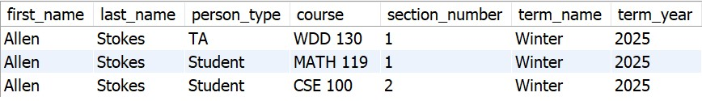
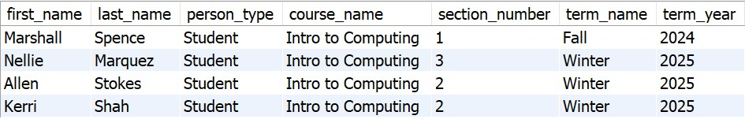
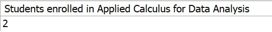

Do the following: 

1) Insert the University data found in university_data.pdf. Use Insert statements with single quotes and save as one file with the forward engineer code from step 2.

2) Make sure your inserts are correct. Write queries to answer the following questions. If they match what is show below, then you are free to submit the file. Please submit the inserts that answer the following questions in a separate file from the combined forward engineering and insert code.

* What classes has Allen enrolled in? Find Allen's full name, what role he is, the course name, the course code (ex. CSE 100 which is the department_code and course_number combined), the section, the semester name, and the year.

* Which students are taking CSE 100? Find the names, the course name, the section, the term name and the year. 

* Count how many students are taking Applied Calculus for Data Analysis in Winter and in Fall.

3) Submit one SQL file that contains the forward engineering code and all your insert statements for all data. Make sure the code that should work is NOT commented out. It must be runnable code.

Please double or even triple check your work before you submit.