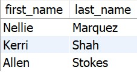

Please check your feedback from part 1 of the project before you begin part 2!

Write the queries listed below using the database you created in part 1. Use comments to number your queries. Use single quotes for string values. If you need help remembering how to do some of these queries, please check out the videos at the bottom of this page under "Helpful Resources." You can do this!

 

Query 1: Students, and their birthdays, of students born in June. Format the date to look like it is shown in the result set.

 

Query 2: Student's age in years and days as of Mar. 10, 2019.  Sorted from oldest to youngest. Duplicates are not allowed.  (You can assume a 365 day year and ignore leap day.) Hint: Use the mod function (shown hereLinks to an external site.) to calculate the days left over after dividing by full years. The 5th column is just the 3rd and 4th column combined with labels.

 

Query 3: Who is enrolled in Web Fundamentals? No duplicates. Order by person_type.

 

Query 4:   Find the TAs. What are their names? Confirm that they are in fact TAs, and find what course they TA for.

 

Query 5: Students that take Intro to Computing in Winter. Sort by student last name.

 

Query 6: What classes does Reed teach? Order by term_name, and section_number.

 

Query 7: The number of students enrolled for Fall

 

Query 8: The number of courses in each department. Sort by department name.

 

Query 9: The total number of students each professor can teach. Sort by that total number of students (teaching capacity).

 

Query 10: Each student's total credit load for Fall 2024, but only students with a credit load greater than or equal to three.  Sort by credit load in descending order. 

Submission:
Double check that your file has been saved and RUN it all at once.

Submit part 1 AND part 2 together in one file.

Please double or even triple check your work before you submit.